Alright. If you are here it means you want to run our program, so let's see how to do that. 

At first, you need a sensor, such as HC‑SR501, or any other sensor in fact, that connects to a Rasberry Pi operating system, or any other os, and the source code, with the exact paths the same as presented in the repository. 

Connect three wires from the sensor as follows:

- left(ground) ===> ground
- middle(output) ===> gpio pin 17
- right(+power) ===> 5V

Next thing you need to do, is connect through your terminal via ssh. You have to know the ip address of your pi. 
Just type: 

- ssh username_in_pi@123.456.78.9

in your terminal.

Once you're in, you have to change the working directory. 
Type: 

cd home_or_whatever/path_to_where_you_git-pulled 

Next thing is one important command: 

docker compose up --build

this builds the entire application, from start to finish. 
Congratulations! You launched our project. 

It downloads anything you don't have, and launches everything. 
--build is not a necessary part of the command, but it rebuilds the whole docker image everytime. If you haven't made locally any change, docker compose up should be alright. 

NOW: 
If you ACTUALLY want to use it, there's a bit more...

You can see many types of messages from the program, if you subscribe to the right topic, according to our setted structure. 

These lines, show the most important messages you can get. What you will see after that is easily assesed. + means that you subscribe to all the possible topics one layer ahead, and # means that you subscribe to all possible topics all layers ahead. 

smartbin/{bin-id}/{sensor-id}/{message-type}

mosquitto_sub -h localhost -t "smartbin/#" -v

mosquitto_sub -h localhost -t "smartbin/bin-01/pir-01/events" -v

mosquitto_sub -h localhost -t "smartbin/bin-01/+/events" -v

mosquitto_sub -h localhost -t "smartbin/+/pir-01/events" -v

mosquitto_sub -h localhost -t "smartbin/bin-01/usage" -v

mosquitto_sub -h localhost -t "smartbin/bin-01/prediction" -v

mosquitto_sub -h localhost -t "smartbin/bin-01/+" -v

Here's a diagram of the structure, so that you know how to go anywhere. 

smartbin
│
├── bin-01
│   │
│   ├── pir-01
│   │   └── events
│   │       └── Raw motion events (JSON-LD)
│   │
│   ├── usage
│   │   └── Rules-based usage level
│   │
│   └── prediction
│       └── ML future activity prediction
│
├── bin-02
│   └── ...
│
└── bin-N
    └── ...

That's pretty much it. As long as you connected everything correctly and followed the instructions, everything should be working fine. 

To generate analytical charts about changes in motion events and latency, run in the working directory:

python analyze.py

in a folder named charts, you will see the charts that were made from analyze.py by reading the logs on events.jsonl. 

Here is an example output of analyze.py that was made by reading our events file:

Chart #1
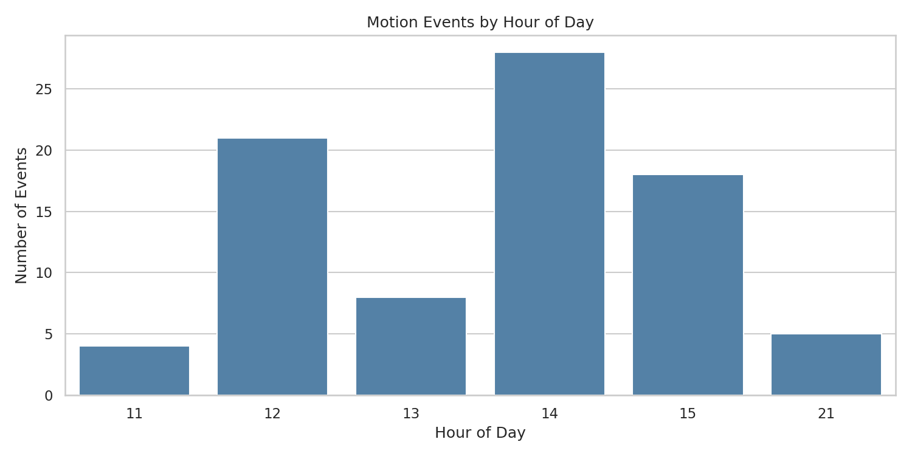

Chart #2
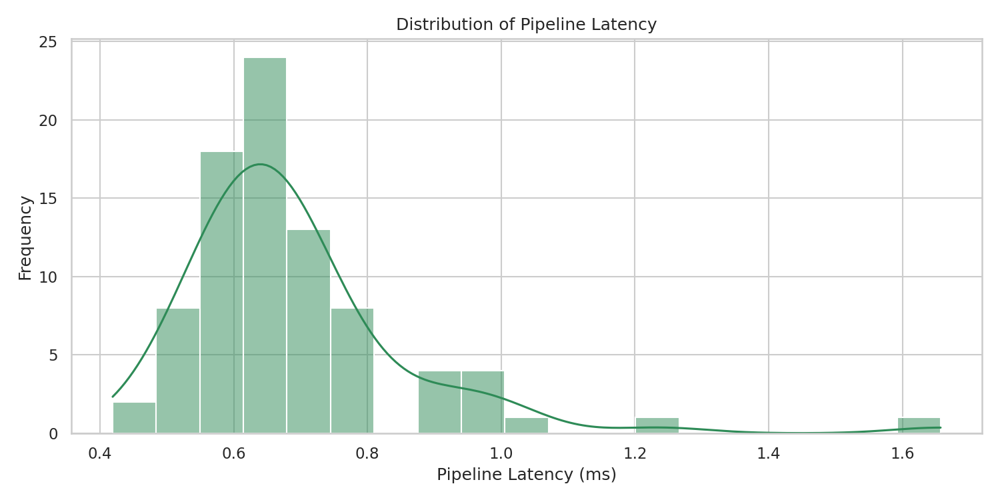

Chart #3
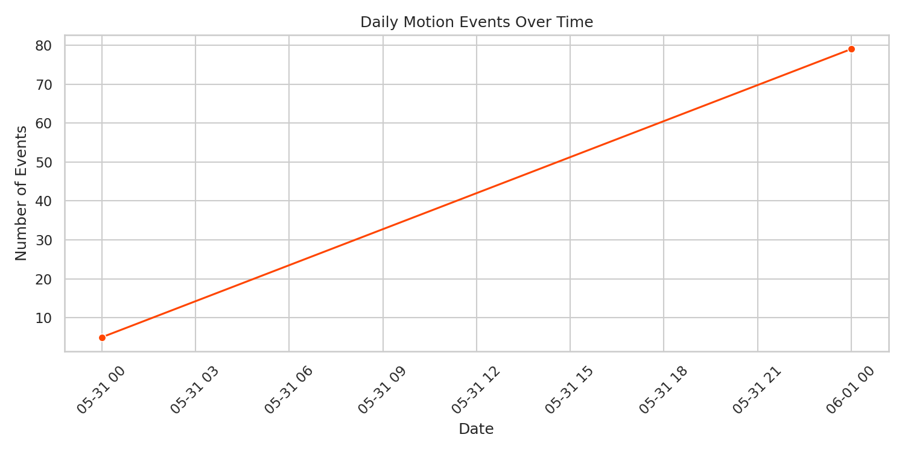

Chart #4
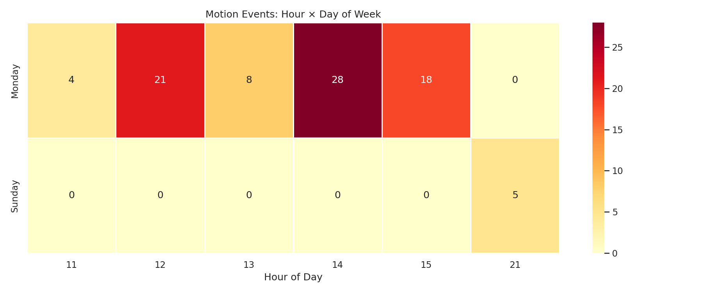

Chart #5
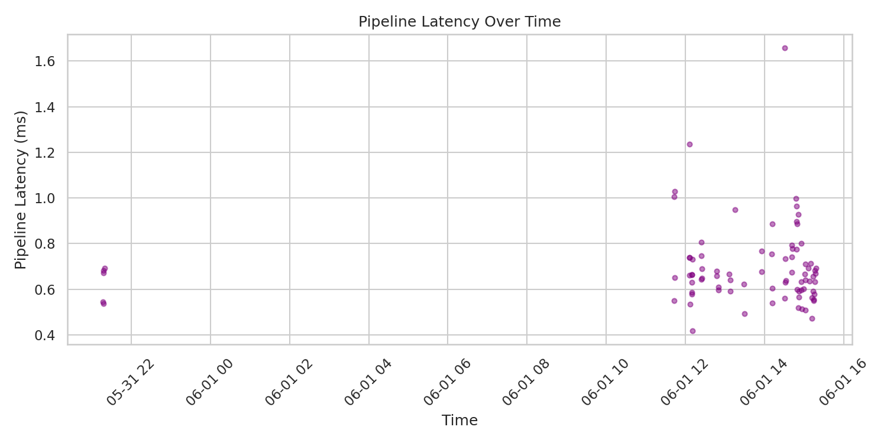

Chart #6
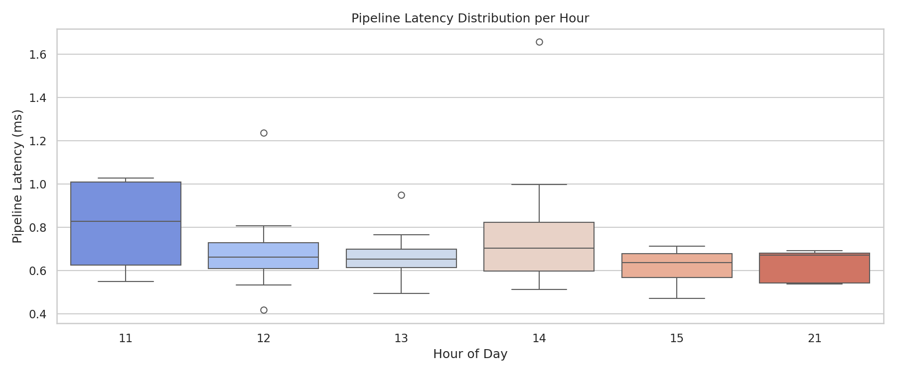

Unfortunately, since we did not have time to containarize home assistant, you won't be able to directly see our instance of home assistant. The configuration of our our instance of home assistant is in the homeassistant.rar file. If you're brave, you may navigate through the configuration files manually to see how we configured home assistant for this project...
Otherwise, we have provided screenshots in our presentation and in the labs. 

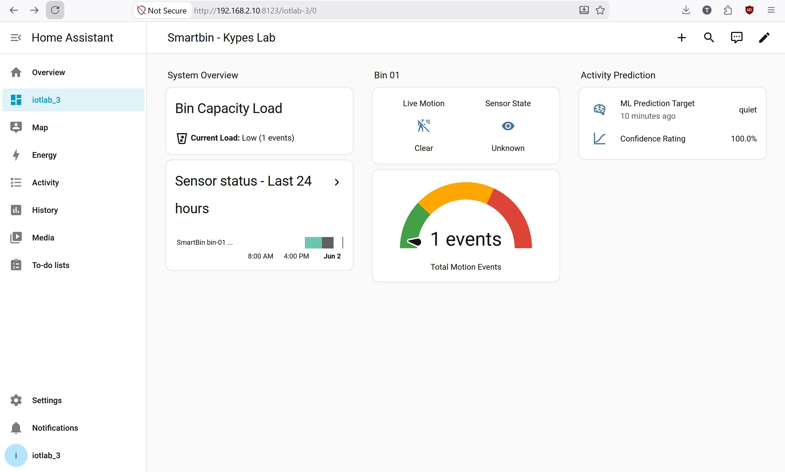

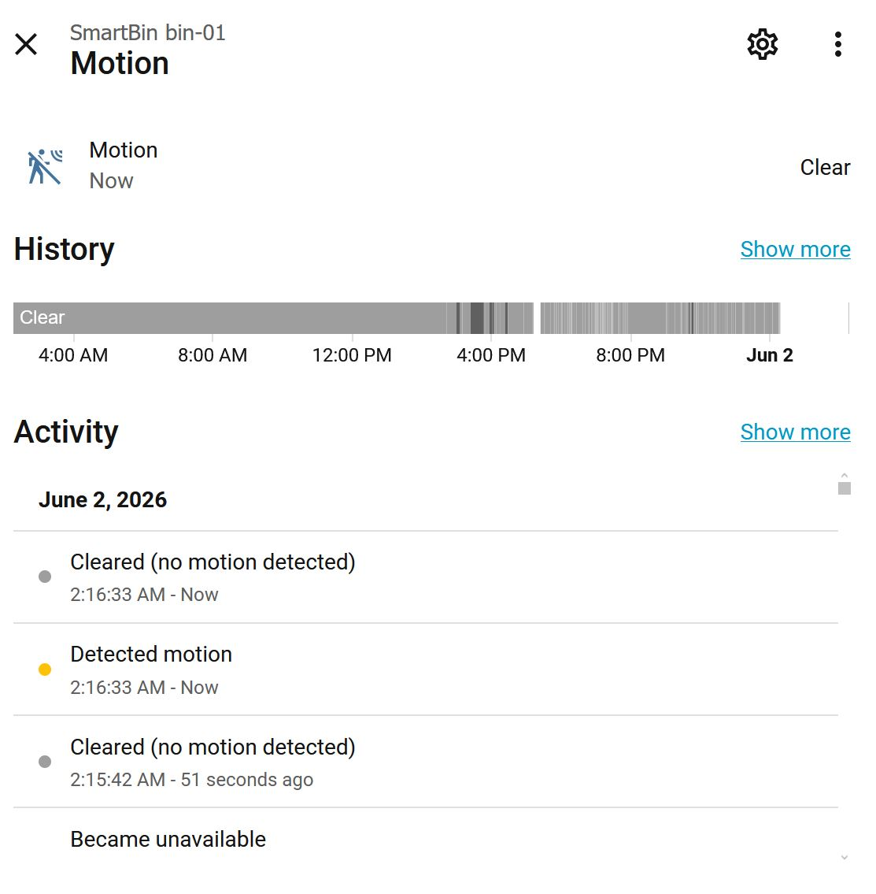

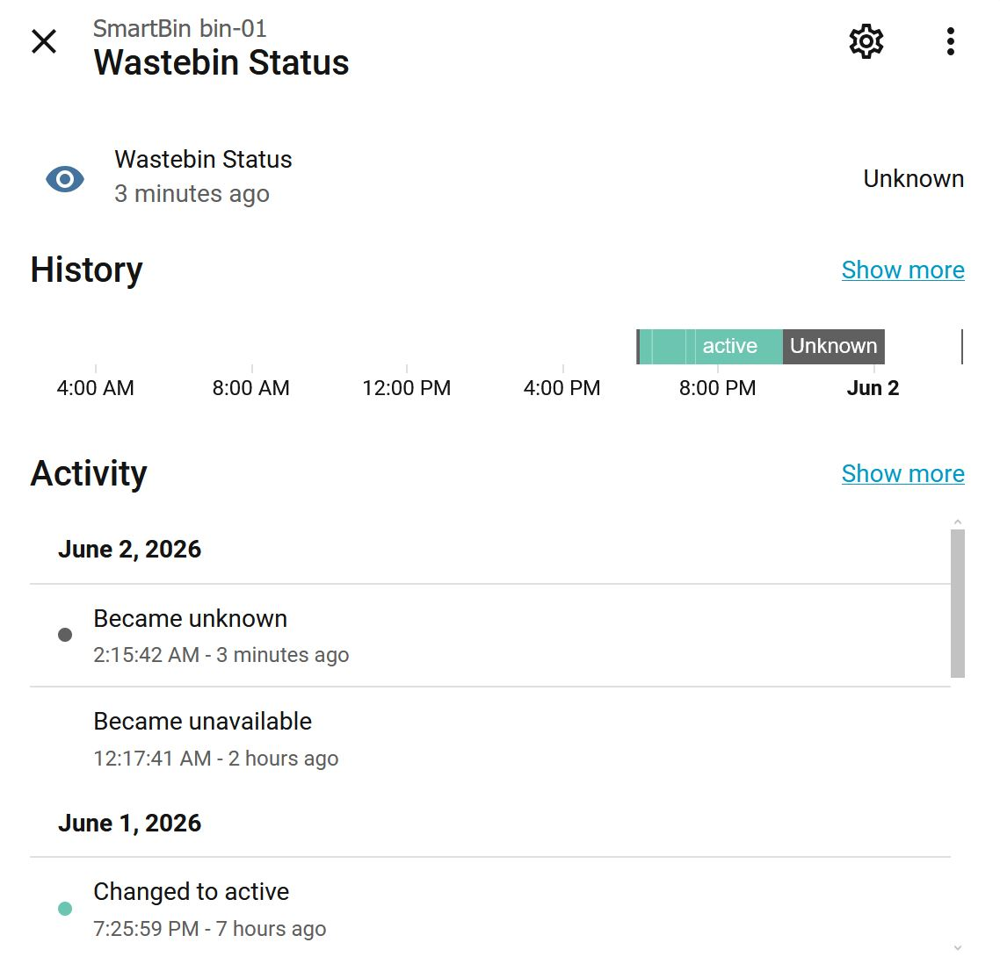

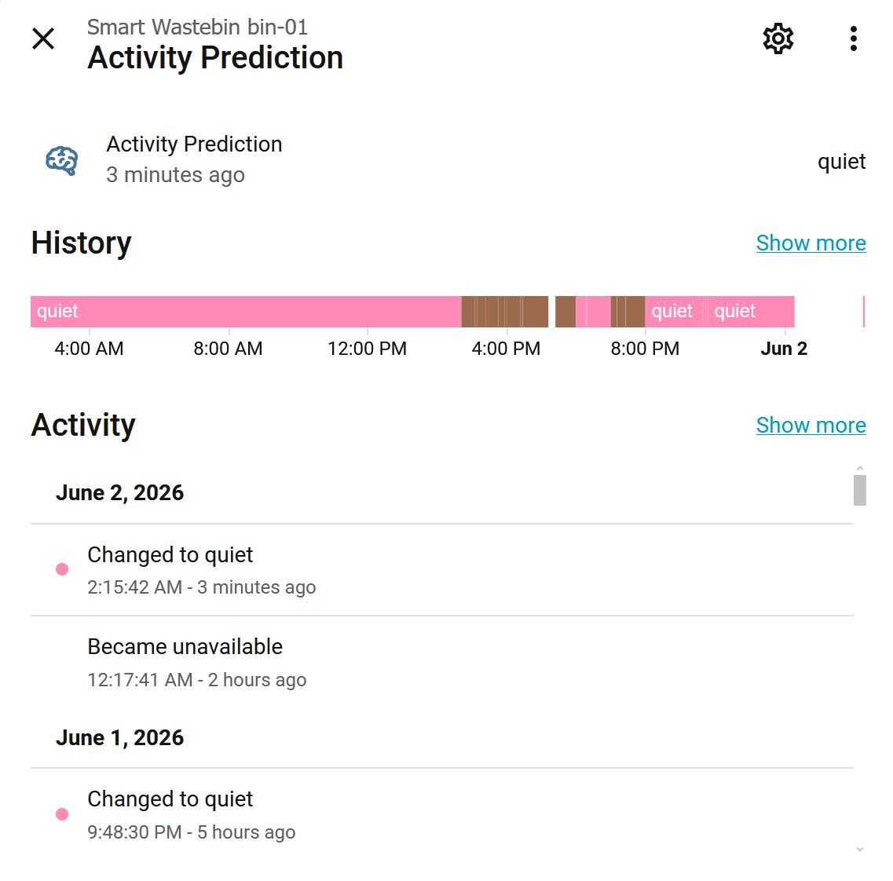

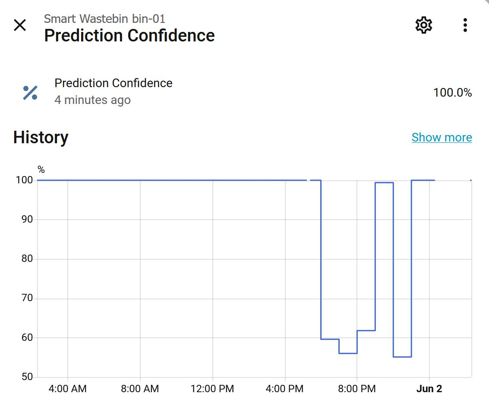

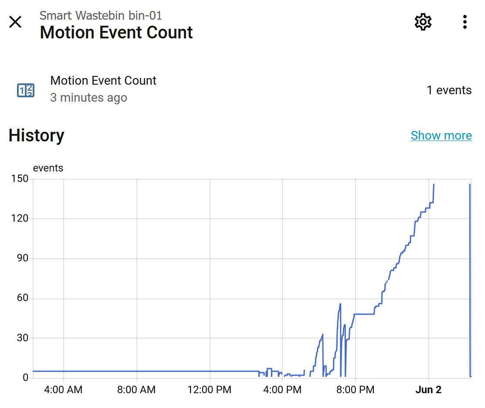

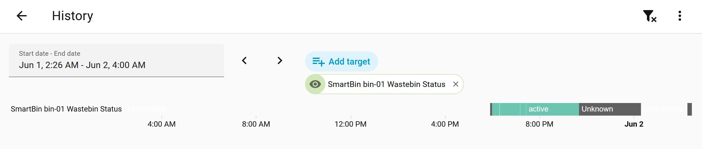

To see your the flows built in Node-Red, click http:/<your-pi-ip>:1880 
Click the menu (three horizontal bars on top right), click import and select the flows.json file inside the node_red folder and then click on deploy to set up the node red framework.

And, if you want to see your data live resting on REST-API, click  http://<your-pi-ip>:5000 
To read the asyncapi yaml, open the swagger editor (link should be present in browser) and import the asyncapi.yaml file inside the api folder, similarly to node red. You should be able to see the full documentation of our topic structure

NOTE: Because the broker is running in a container, if you want to publish/subscribe to a topic, you will need to add this prefix before the command : docker exec -it smartbin-broker

e.g docker exec -it smartbin-broker mosquitto_sub localhost -t "smartbin/bin-01/#"

That, was all, enjoy. 

